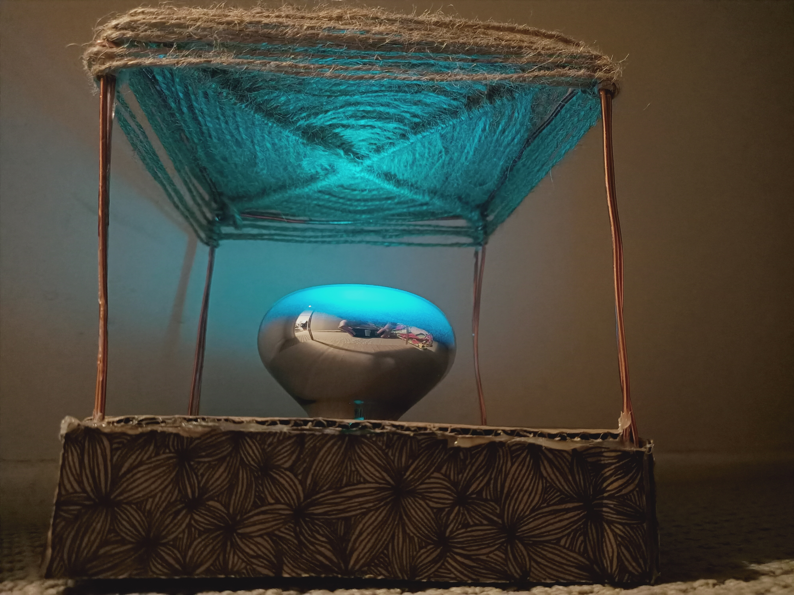
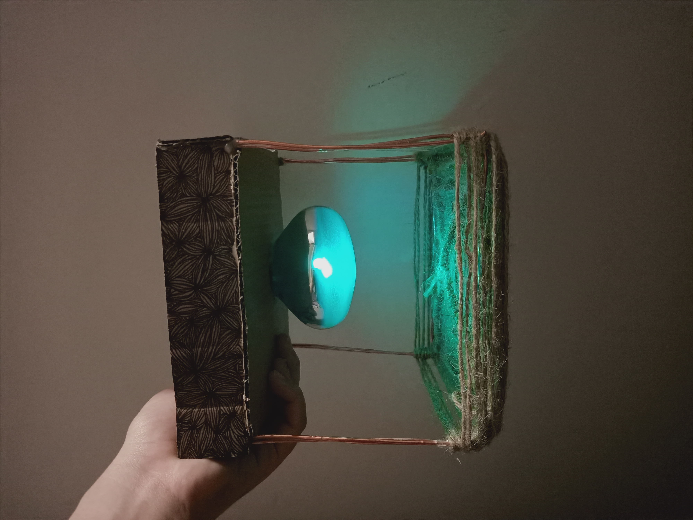
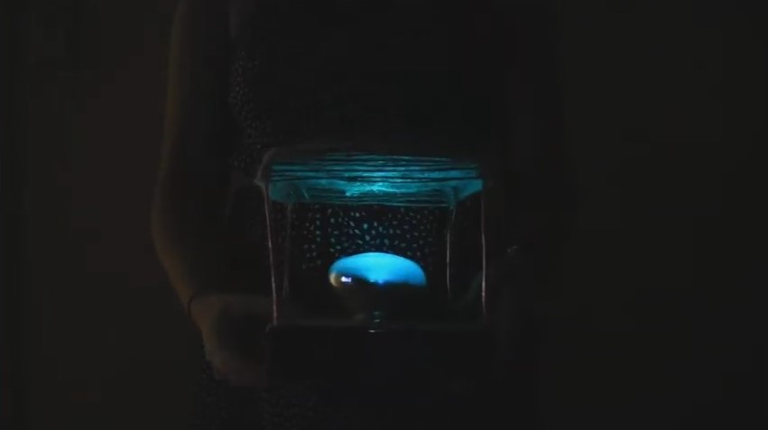

# *Mood Cube*
## *Jasmine Riri-Duscher* ##
## 1701QCA Making Interaction 2020 Final Project ##

<!--- Instructions for the journal will mostly be included as comments, which appear in a block like this that opens with a less than symbol, exclamation mark and three hyphens and closes with three hyphens and a greater than symbol. Make sure you do not include any text you want visible within these symbols or it will not be visible to your instructor. In some cases, such as in headings, there is italicised text included between asterisks that needs to be replaced. --->

<!--- When you have completed the template, submit the link to the GitHub Pages site for this repository as a link in Learning@Griffith. The link should be something like [https://qcainteractivemedia.github.io/1701QCA-Assessment3/](https://qcainteractivemedia.github.io/1701QCA-Assessment3/) where `qcainteractivemedia` is replaced with your GitHub username and `1701QCA-Assessment3` is replaced with whatever you called the repository this template is contained in when you set it up. You should NOT be submitting a link that begins with github.com/[your user name] as that is not the rendered version. See the instructions about creating GitHub pages to see how to get the link to the rendered page. --->

<!--- SHOWCASE IMAGE: Insert a showcase image here. Try to capture the image as if it were in a portfolio, sales material, or project proposal. The project isn't likely to be something that finished, but practice making images that capture the project in that style. 

The image should be inserted with code like that below where you replace the filename to exactly match what you uploaded. This will only work reliably if your filename has no spaces or unusual characters in it. The image must be in .jpg, .gif, .png format. Files of .heic or .heif type will not show up. Note that .png is different to .PNG in a filename here. The names are case sensitive.
--->

<!--- PROJECT DESCRIPTION: In a few sentences, describe what the project is and does, who it is for, and a typical use case. This should be suitable for a catalog, poster, or other display material about the project. --->

<!--- SECONDARY IMAGE: Provide some other image that gives a viewer a different perspective on the project such as more about how it functions, the project in use, or something else. This should not just be a different angle of the same object. It should show the project in use if the first image didn't show that, or somehow tell us a different story about the project. --->

This is the mood cube; a tangible object that can be oriented in order to express mood or an emotional state. It uses an accelerometer to control the colour of an RGB LED, making the mood cube's trigger orientation-based. This product is made for anyone who wants functionality and fun all in one! The mood cube can act as a desk light with its normal yellow light or illuminate your room with the colour of your choice. The way you use it is up to you.

<!--- PROJECT VIDEO: Provide a still image from your video and a link to the video below. In that code, replace `missingimage.png` with the still from your video and the URL of the video where indicated. If you link to a password protected video, you must include the password in the document you submit through Learning@Griffith. Failing to have a video that we can access might lead to significant reduction in marks, potentially as much as if the video has not been submitted at all. --->

### Journal ###

<!--- The following link will direct to your process and reflection journal, which will be held in the file `journal.md` in the folder called `journal`. This link should not be changed. --->
[Process and reflection journal](/journal/journal.md)
