# 1701QCA Final project journal: *Jasmine Riri-Duscher*

<!--- As for other assessments, fill out the following journal sections with information relevant to your project. --->

<!--- Markdown reference: https://guides.github.com/features/mastering-markdown/ --->

## Related projects ##
<!--- Find about 6 related projects to the project you choose. A project might be related through  function, technology, materials, fabrication, concept, or code. Don't forget to place an image of the related project in the appropriate folder and insert the filename in the appropriate places below. Copy the markdown block of code below for each project you are showing. --->

### Related project 1 ###
Ever Blooming Mechanical Tulip

https://www.hackster.io/jiripraus/ever-blooming-mechanical-tulip-1b0323

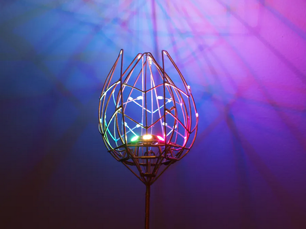

This project is related to mine because of the use of light, and movement to present emotions in an interactive way. This flower includes a smaller leaf which is connected to a touch sensor. When activated, the flower will begin to bloom with the LED's shining multiple colours. 

### Related project 2 ###
Solar Powered LED Parking Sensor

https://www.hackster.io/aams86/solar-powered-led-parking-sensor-9dd11d

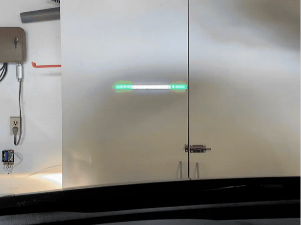

This project is related to mine because it uses LED's to reflect something; in this case, the proximity of a car. The mood cube uses LED's to reflect mood and an emotional state.

### Related project 3 ###
Stereo NeoPixel Ring VU Meter

https://create.arduino.cc/projecthub/ericBcreator/stereo-neopixel-ring-vu-meter-b28e78?ref=tag&ref_id=lights&offset=8

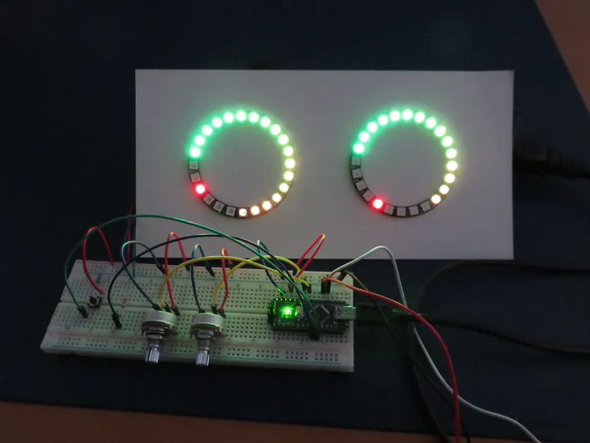

This project is related to mine because the LED's react to a change in the device. In the mood cube the change would be orientation, whereas in the uv meter, it is the dials on the back.

### Related project 4 ###
Virtual Arduino Tennis

https://create.arduino.cc/projecthub/gatoninja236/virtual-arduino-tennis-3700ce?ref=tag&ref_id=accelerometer&offset=4

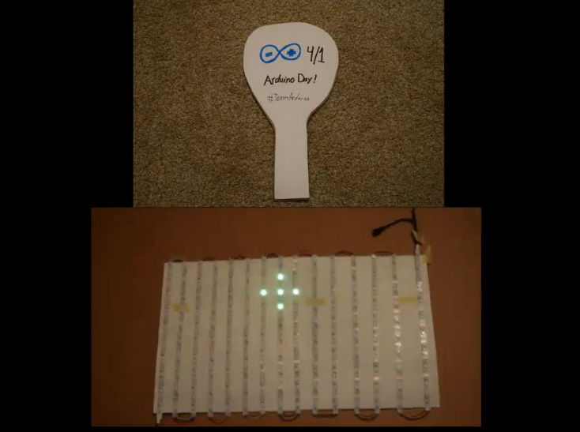

This project is related to mine because it uses an accelerometer to trigger LEDs. The Arduino Tennis project has used its accelerometer to interact with a neopixel matrix in order to simulate playing tennis. My chosen project is similar because the accelerometer triggers the LEDs to change, only in a simpler way.

### Related project 5 ###
Vernal

https://create.arduino.cc/projecthub/vexelius/vernal-3c7dc0?ref=tag&ref_id=accelerometer&offset=18

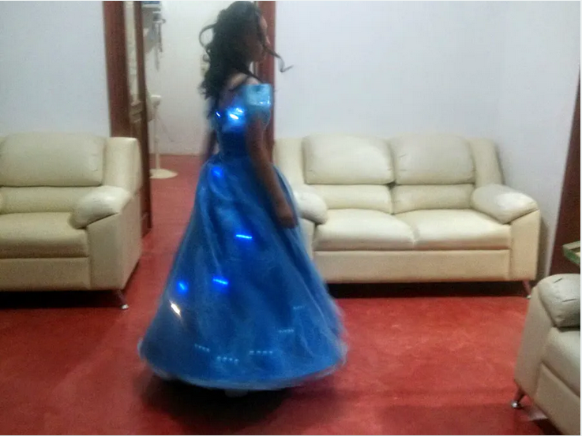

This project is related to mine because the movement of the object controls the behaviour of the LEDs. This custom dress reacts to the wearer's movements by illuminating the lights that were stiched inside. My project also uses movement to light specific LEDs.

### Related project 6 ###
Gesture Control Robot

https://create.arduino.cc/projecthub/raunak-oberai/gesture-control-robot-ff1307?ref=tag&ref_id=accelerometer&offset=1

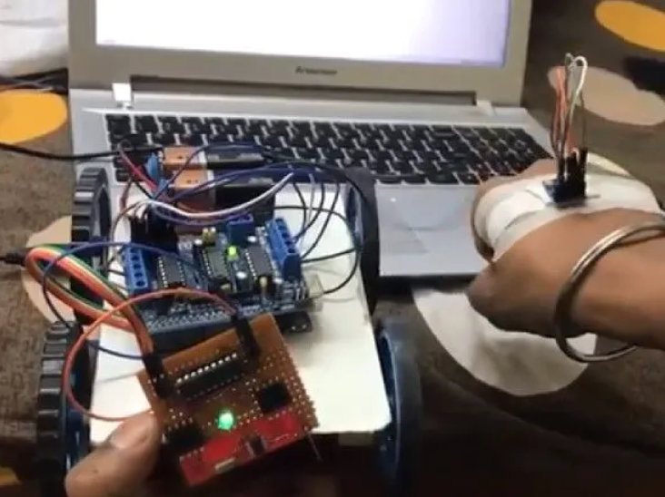

This project is related to mine because an acceleromter has been used to control another device. In this case, the orientation of the operators hand is controlling a robot whereas the mood cube uses orientation to simply switch the colour of an LED to its corresponding side.

## Other research ##
<!--- Include here any other relevant research you have done. This might include identifying readings, tutorials, videos, technical documents, or other resources that have been helpful. For each particular source, add a comment or two about why it is relevant or what you have taken from it. You should include a reference or link to each of these resources. --->

### *Brief resource name/description* ###

There were two problems that I encountered when beginning to develop my project: I had no idea how to code an accelerometer and no clue how to code an LED. Because of this, most of the research has been videos and websites that explain how these technologies work and how to program them.

https://www.youtube.com/watch?v=5M9p25OfKdg
This video source provided the basics of two types of LED and how they operated. I used this resource as a way to better understand LEDs and how they can be used

https://microbit-challenges.readthedocs.io/en/latest/tutorials/accelerometer.html
This source was by far the most helpful in understanding how an accelerometer works and how to program it. There is an enourmous amoutn of information on the measurements, how to write the measurments yourself and even some javascript gestures for more efficient coding.

https://makecode.microbit.org/reference/input/acceleration
The video on this website was a crash course in acceleration and how the accelerometer used this to calculate orientation. This was very helpful in understanding how accelerometers work in a fun way.

https://makecode.microbit.org/v0/69147-92003-84850-59500
This source was a microbit project that used the accelerometer. I looked over the code provided to understand the accelerometer better.

https://makecode.microbit.org/projects/guitar/accelerometer
This is a resource from the guitar project which includes the accelerometer. I did not learn much from this source but still wanted to reflect on it just in case there was extra information.

https://www.youtube.com/watch?v=nMxvdL9yvmo
This video source was a step-by-step tutorial of the accelerometer. This is when I learned which orientation contributed to which measurement and how to correctly adjust this to my needs for this project.

https://learn.sparkfun.com/tutorials/sparkfun-inventors-kit-for-microbit-experiment-guide/experiment-4-driving-an-rgb-led
This source was an experiement guide that used an RGB LED. The code was helpful in confirming my knowledge of how to change colours of the LED.

https://www.101computing.net/bbc-microbit-rgb-gradient/
This resource was a tutorial about achieving a gradient with an RGB LED. The information I took away from this source is that three of the four LED pins need resistors. This information of cathodes and anodes was new and, therefore, very helpful.

http://www.microbitlearning.com/code/arduino/microbit-basic-rgb-led-example.php
This resource was similar to the previous one as it provided a diagram with the pins and corresponding resistors. The set up was minutely different but the outcome seemed the same.

http://planetpixelemporium.com/tutorialpages/light.html
This website contains information about real world light sources. This source was used to find the RGB of a yellow light that would be on the base side of the cube.

https://www.w3schools.com/colors/colors_picker.asp
This source is used to find colours for html. I have utilised this source that I use for other classes to be able to pick the colours I desire on the mood cube and then copy the corresponding RGB.

## Conceptual development ##

### Design intent ###
A tangible object that expresses mood through orientation.

### Design ideation ###
<!--- Document your ideation process. This will include the design concepts presented for assessment 2. You can copy and paste that information here. --->

### Final design concept ###

A mood cube that displays different colours when placed on each of its sides. It would contain an accelerometer that measures the change in orientation in order to display a specific colour via LED. The purpose of this object to provide a physical object that can be oriented in order to express mood or an emotional state.

The materials will be gold or copper wire and cardboard, creating a rustic and hipster lamp aesthetic. The cardboard will only be on the 'base' side and will have all the electricals inside while the wire will create the rest of the shape. The lightbulb and LED will be protruding from the 'base' side, coming out of the cardbord. Everything will be secured with hot glue and wire, possibly super glue if necessary.

Notes:
Afer further thought, there will be no emoticons/icons on this device. This will not suit the desired aesthetic and icreases the difficulty of the project.

### Interaction flowchart ###
<!--- Include an interaction flowchart of the interaction process in your project. Make sure you think about all the stages of interaction step-by-step. Also make sure that you consider actions a user might take that aren't what you intend in an ideal use case. Insert an image of it below. It might just be a photo of a hand-drawn sketch, not a carefully drawn digital diagram. It just needs to be legible. --->

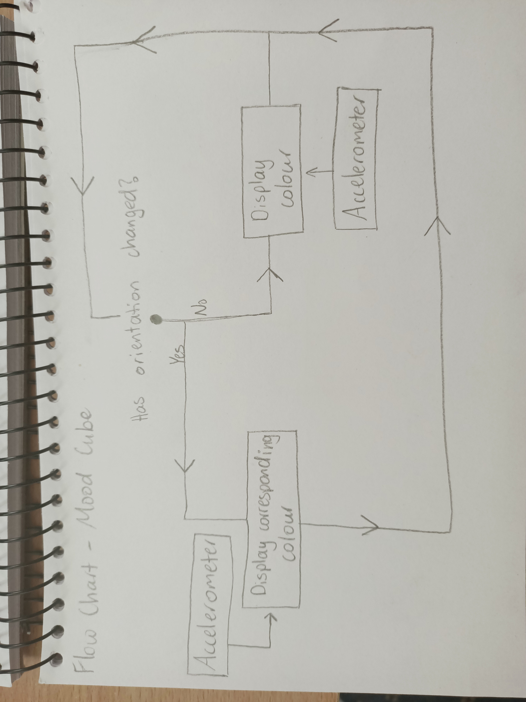

## Process documentation ##
<!--- In this section, include text and images (and potentially links to video) that represent the development of your project including sources you've found (URLs and written references), choices you've made, sketches you've done, iterations completed, materials you've investigated, and code samples. Use the markdown reference for help in formatting the material.

This should have quite a lot of information! It will likely include most of the process documentation from assessment 2 which can be copied and pasted here.

Use subheadings to structure this information. See https://guides.github.com/features/mastering-markdown/ for details of how to insert subheadings.

There will likely by a dozen or so images of the project under construction. The images should help explain why you've made the choices you've made as well as what you have done. --->

### Technical Development ###

After researching into RBG LEDs and the accelerometer, it was time to start coding. This began with a piece of paper to help visualise the pins that would connect the microbit and LED, the orientation of the microbit and any associated mathematics, as well as the RGB of each of the colours I wanted.

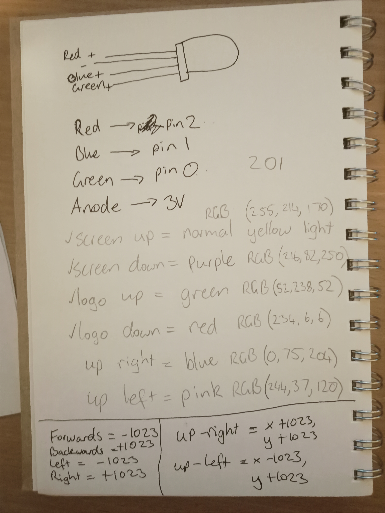

I started coding after having this plan and it began with the accelerometer. There is a gesture block that gives an orientation without any numbers and using that was effiecient for four of the six sides. Two of them had to calculated using the X and Y axis'. That code is as follows:

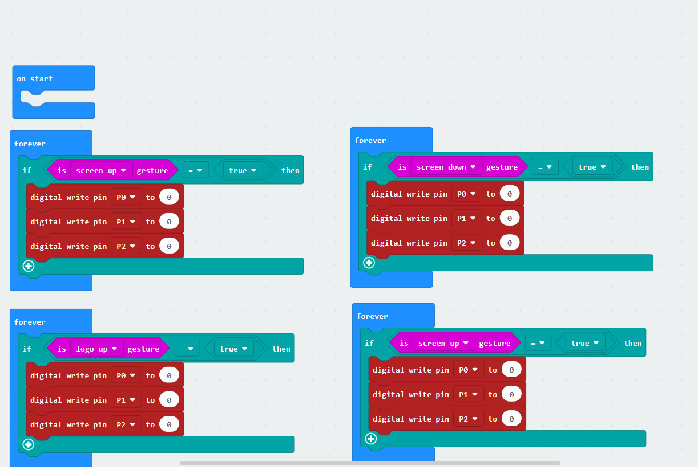
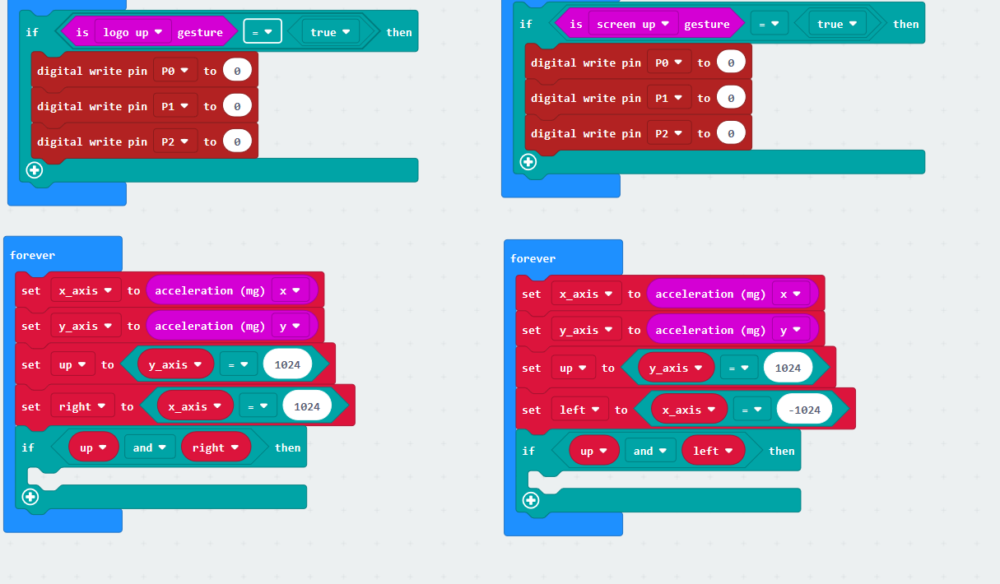

After those values and logic blocks were added, it was just a matter of adding the RGB values according to the specific pins that they were assigned to. The only problem with this step is I am unsure as to how the RGB values are meant to be added to pins.

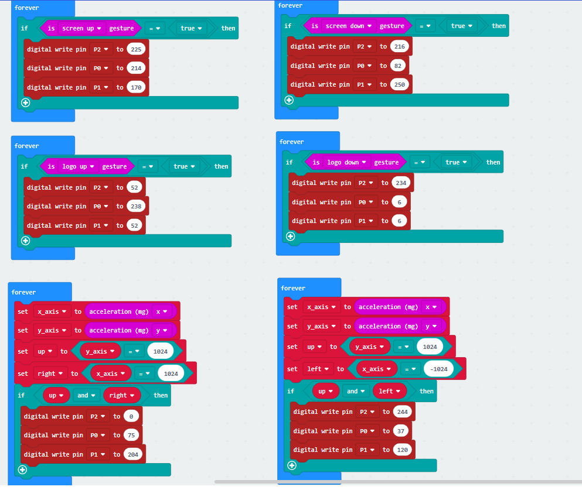

### Fabrication ###

The first development that happened was a 3D model of the hexagonal shape. The fabricaiton of this object was purely to see how each it was to hold and move, as well as space for electricals, etc. I started by searching 'hexagon shape' into Google Images and tracing it onto a piece of paper. I then used this as a guide in order to cut out twelve hexagons.

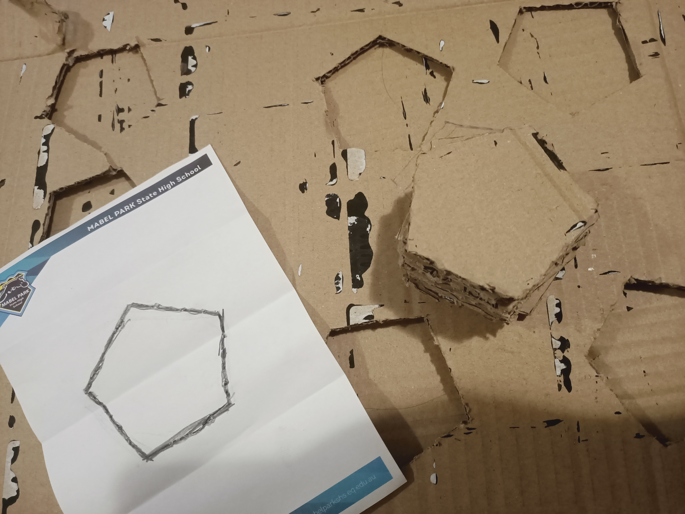

I then used tape and tried to piece them all together. This turned out to be incredibly difficult, taking almost an hour and falling apart many times before and after. It was very easy to hold and move but there weretoo many complications that the shape presented. There was not enough space to hold the electricals without interfering with the shifting of the weight. Also, there was no way to easily recreate this shape whcih limited prototypes and refinement.

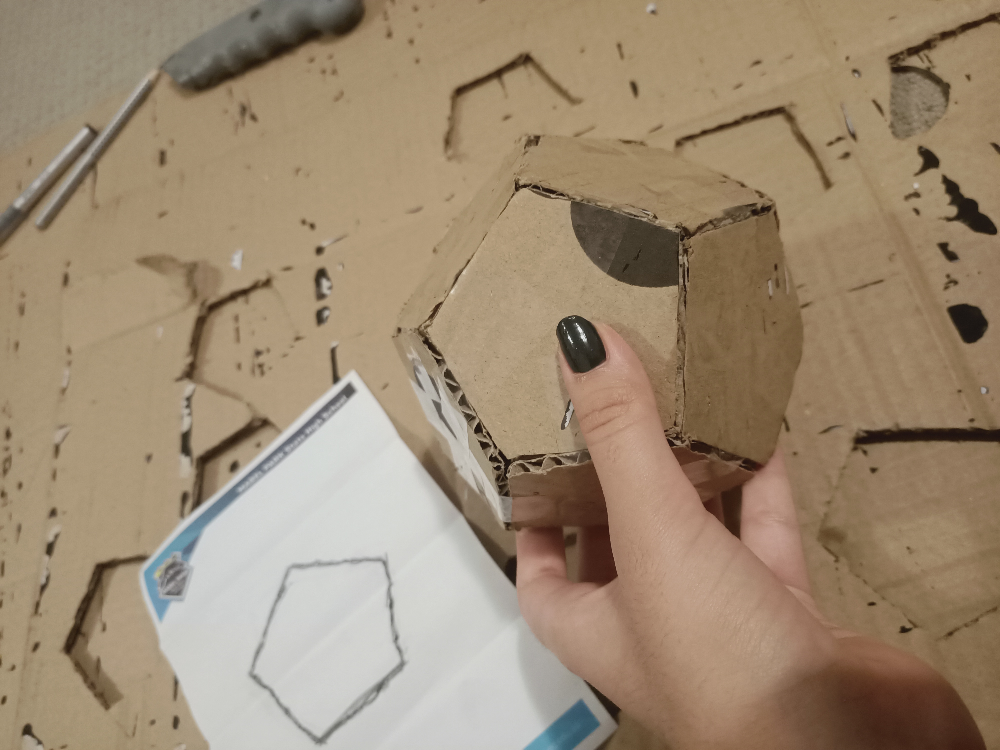

After further thought, the sketch was redrawn to more accurately represent the object I am aiming for within this project.

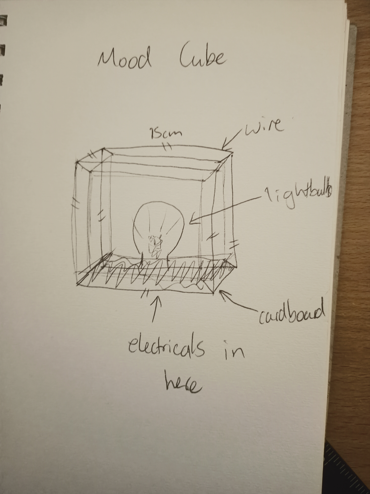

This is a rough idea of the final product. It appears as a smaller cube inside of a larger cube with the lightbulb and cardboard attached to the 'base' side. It was decided that the base side will contain a normal yellow light colour to maintain functionality.

The material for the final product was very difficult to find but I wanted to stick to the aesthetic I set. After finally obtaining the material I wanted, which ended up being a rose gold aluminium wire, I began to test different way to create a cube. The first was just a cube shape with no excess wire. This was not going to work since I could not rely on glue to hold the edges together.

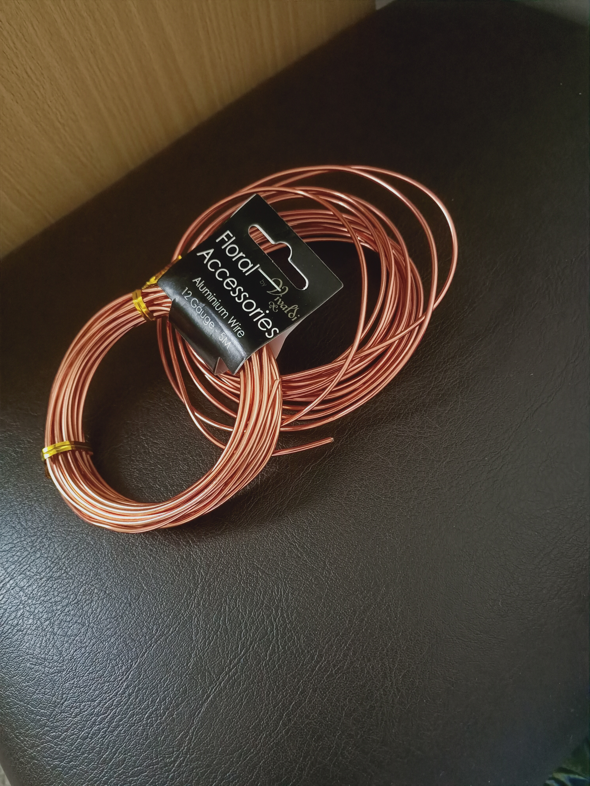
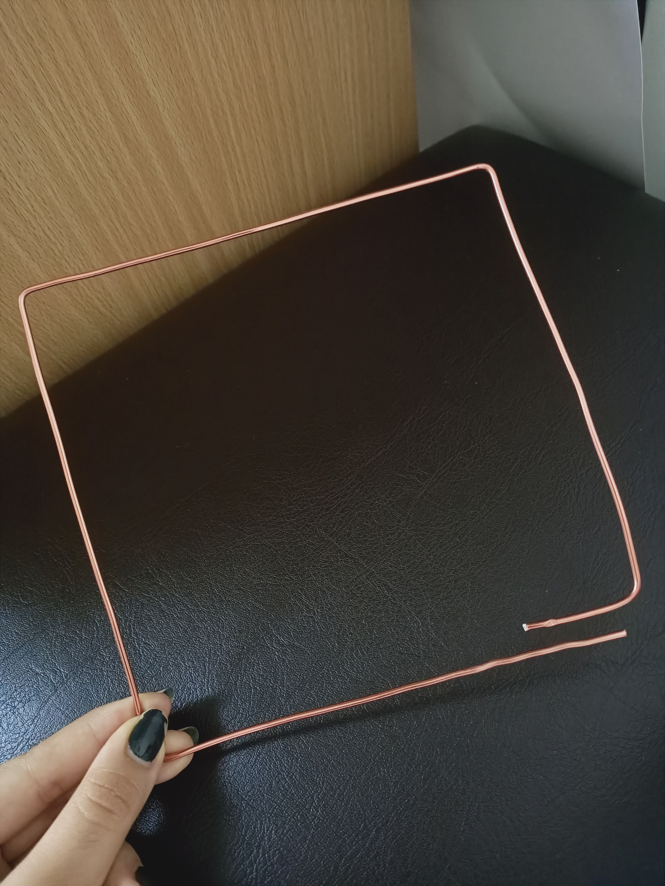

The next idea was to have excess wire in order to wrap it around and create a never ending line that made the entire cube. This ended up being really tedious and time consuming.

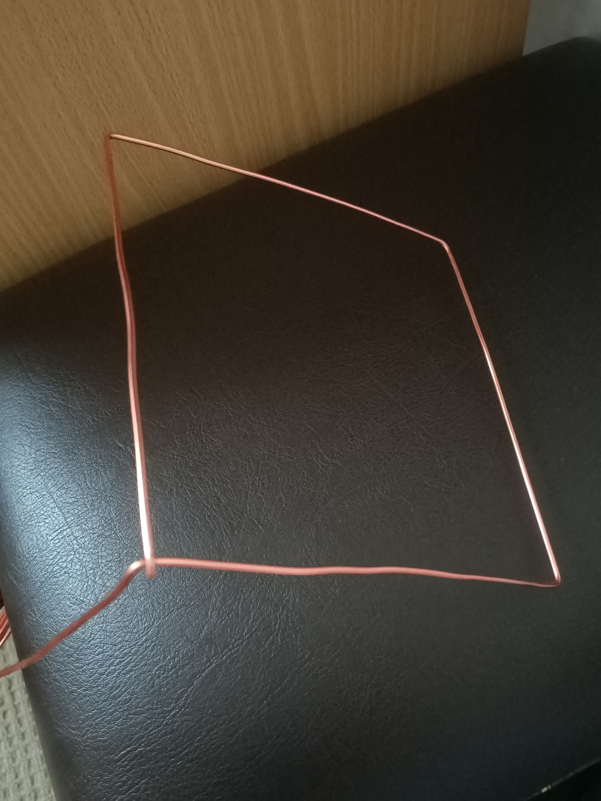

It was then decided to create a square shape with excess on two sides in order to make a clamp to hold it together. This attempt was the most successful and least time consuming. The only problem is how the sides are all going to be attached to each other. My first ideas to solve this have been hot glue, coil the wire around and seeing if it will melt enough to mould together.

## Design process discussion ##

In the beginning, I wanted to create a sort of launch pad and experiment with musical interactions. This idea was removed quite quickly since 'the first idea is always the worst one' and it would have been too difficult to create within the time frame. I then moved on to other ways people interacted with objects and how that might affect a person's emotional state. After viewing the Heartbeat art installation by Charles Petillion, I began to create ideas surrounding light and perspective. This then altered into my current design intent: A tangible object that expresses mood through orientation.

All of these ideas were synthesized throught the Double Diamond design methodology, even if I wasn't aware of the fact. It has been a constant loop of the first diamond ot produce the ideas and a loop for after the second diamond with my development of my design intent. It began with ideas of what to create and now it is refining those ideas in to realistic solutions. It has now become a loopof the second diamond as there have been tweaks in the code, changes to the materials and aesthetics, as well as different shapes and development methods. I have gotten this current point by discovering and defining repetitvely in order to move on to the develop and delivering phases, which have evended up being just as repetative.

## Final code ##

<!--- Include here screenshots of the final code you used in the project if it is done with block coding. If you have used javascript, micropython, C, or other code, include it as text formatted as code using a series of three backticks ` before and after the code block. See https://guides.github.com/features/mastering-markdown/ for more information about that formatting. --->

## Design process discussion ##
<!--- Discuss your process used in this project, particularly with reference to aspects of the Double Diamond design methodology or other relevant design process. --->

## Reflection ##

<!--- Describe the parts of your project you felt were most successful and the parts that could have done with improvement, whether in terms of outcome, process, or understanding.

What techniques, approaches, skills, or information did you find useful from other sources (such as the related projects you identified earlier)?

What parts of your project do you feel are novel? This is IMPORTANT to help justify a key component of the assessment rubric.

What might be an interesting extension of this project? In what other contexts might this project be used? --->
